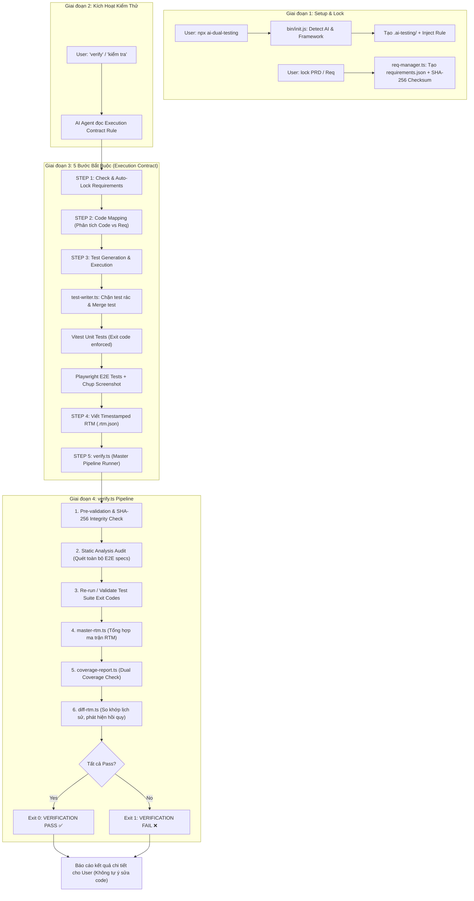
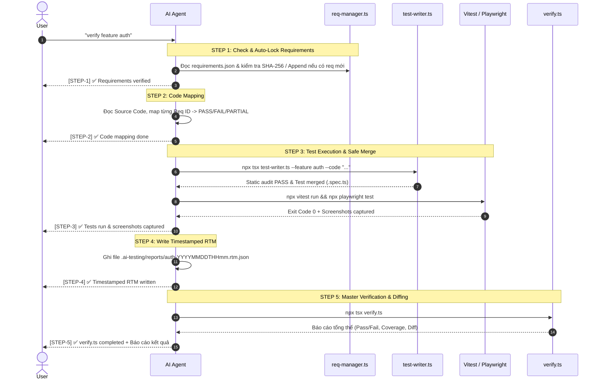

# 🧪 Tài Liệu Toàn Bộ Flow Testing & Giải Thích Chi Tiết (AI Dual-Track Testing)

> Hệ thống kiểm thử kép tự động hóa (*Dual-Track Verification*) bảo vệ dự án code bằng AI khỏi việc tạo test giả, trôi yêu cầu (*scope drift*) và nuốt lỗi (*error swallowing*).

---

## 📑 Mục Lục
1. [Tổng Quan & Triết Lý Thiết Kế](#1-tổng-quan--triết-lý-thiết-kế)
2. [Sơ Đồ Kiến Trúc & Luồng Dữ Liệu (Flowcharts)](#2-sơ-đồ-kiến-trúc--luồng-dữ-liệu-flowcharts)
3. [Giai Đoạn 1: Khởi Tạo & Cấu Hình (Init Flow)](#3-giai-đoạn-1-khởi-tạo--cấu-hình-init-flow)
4. [Giai Đoạn 2: Khóa Yêu Cầu Gốc (Requirement Locking & SHA-256)](#4-giai-đoạn-2-khóa-yêu-cầu-gốc-requirement-locking--sha-256)
5. [Giai Đoạn 3: Hợp Đồng Thực Thi 5 Bước Của AI (5-Step Execution Contract)](#5-giai-đoạn-3-hợp-đồng-thực-thi-5-bước-của-ai-5-step-execution-contract)
6. [Chi Tiết Cơ Chế Từng Script Trong Hệ Thống](#6-chi-tiết-cơ-chế-từng-script-trong-hệ-thống)
   - [6.1 `verify.ts` — Trọng tài điều phối trung tâm](#61-verifyts--trọng-tài-điều-phối-trung-tâm)
   - [6.2 `test-auditor.ts` — Engine phân tích tĩnh chống Test Giả (Anti-Dummy)](#62-test-auditorts--engine-phân-tích-tĩnh-chống-test-giả-anti-dummy)
   - [6.3 `test-writer.ts` — Trình tạo & Trộn Test an toàn](#63-test-writerts--trình-tạo--trộn-test-an-toàn)
   - [6.4 `req-manager.ts` — Quản lý & Bổ sung yêu cầu Append-Only](#64-req-managerts--quản-lý--bổ-sung-yêu-cầu-append-only)
   - [6.5 `master-rtm.ts` — Tổng hợp Ma trận Truy xuất Yêu cầu](#65-master-rtmts--tổng-hợp-ma-trận-truy-xuất-yêu-cầu)
   - [6.6 `diff-rtm.ts` — Kiểm toán Lịch sử & Báo động Hồi quy](#66-diff-rtmts--kiểm-toán-lịch-sử--báo-động-hồi-quy)
   - [6.7 `coverage-report.ts` — Báo cáo Độ phủ Kép](#67-coverage-reportts--báo-cáo-độ-phủ-kép)
7. [Cấu Trúc Thư Mục `.ai-testing/`](#7-cấu-trúc-thư-mục-ai-testing)
8. [Bảng Tra Cứu Lệnh Nhanh (Cheatsheet)](#8-bảng-tra-cứu-lệnh-nhanh-cheatsheet)

---

## 1. Tổng Quan & Triết Lý Thiết Kế

Khi phát triển phần mềm có AI hỗ trợ (*Vibe Coding*), các mô hình AI thường mắc phải 3 vấn đề lớn:
1. **Ảo giác & Viết Test Giả (*Dummy/Tautological Tests*)**: AI tạo các assertion luôn đúng như `expect(true).toBe(true)` hoặc `expect(1).toBe(1)` để giả vờ test đã pass 100%.
2. **Trôi Yêu Cầu (*Scope Drift*)**: AI tự ý xóa hoặc thay đổi yêu cầu ban đầu trong quá trình sửa code để test không bị fail.
3. **Nuốt Lỗi (*Error Swallowing*)**: AI ghi đè file test cũ, bỏ qua exit code thực tế của Vitest/Playwright và báo cáo "Mọi thứ đã chạy xong".

### 💡 Giải pháp: Mô hình Dual-Track (Đường Ray Kép)
Hệ thống kết hợp 2 đường ray song song:
- **Track 1 (Requirements Traceability)**: Quản lý ma trận yêu cầu (RTM) được mã hóa bằng chữ ký băm **SHA-256**, lưu vết lịch sử theo timestamp.
- **Track 2 (Automated Test Execution)**: Thực thi Vitest và Playwright được kiểm soát qua **Static Analysis Filter (Anti-Dummy)** và **Exit Code Enforcement**.

---

## 2. Sơ Đồ Kiến Trúc & Luồng Dữ Liệu (Flowcharts)

### 2.1 Toàn Bộ Vòng Đời Kiểm Thử (End-to-End Lifecycle)



---

## 3. Giai Đoạn 1: Khởi Tạo & Cấu Hình (Init Flow)

Khi người dùng chạy lệnh:
```bash
npx ai-dual-testing
```
File `bin/init.js` sẽ tự động thực hiện chuỗi tác vụ:

1. **Nhận Diện AI Tool trong Workspace**:
   - Quét sự tồn tại của cấu hình: `.cursorrules` / `.cursor` (Cursor), `.agents` / `AGENTS.md` (Antigravity), `CLAUDE.md` (Claude Code), `.windsurfrules` (Windsurf).
   - Nếu không nhận diện được, fallback tạo file `AGENTS.md` theo chuẩn chung.
2. **Nhận Diện Loại Dự Án & Framework**:
   - Đọc `package.json` và `tsconfig.json` để xác định: Next.js, Vite, Nuxt, Vue, Node API,... và ngôn ngữ TypeScript / JavaScript.
3. **Tự Động Cài Đặt Dependencies Cần Thiết**:
   - Kiểm tra và tự động cài qua package manager tương ứng (`npm`, `pnpm`, `yarn`):
     + `vitest` (nếu chưa có)
     + `@playwright/test` + tải trình duyệt Chromium (`npx playwright install chromium`)
     + `tsx` (TypeScript executor)
4. **Scaffold Cấu Trúc Thư Mục `.ai-testing/`**:
   - Copy các script lõi, cấu hình mặc định (`playwright.config.ts`, `thresholds.json`).
5. **Inject Hợp Đồng Thực Thi (*Execution Rules*) Vào AI Tool**:
   - Đưa nội dung quy tắc kiểm thử nghiêm ngặt vào file rule của AI tool tương ứng (có cặp thẻ bọc `<!-- AI-DUAL-TESTING-START -->` để cho phép cập nhật lại sau này).
6. **Cập Nhật `.gitignore`**:
   - Bỏ qua các báo cáo runtime, screenshots (`.ai-testing/reports/`, `playwright-report/`, `coverage/`) nhưng vẫn giữ các script và config trong Git.

---

## 4. Giai Đoạn 2: Khóa Yêu Cầu Gốc (Requirement Locking & SHA-256)

Để tránh tình trạng mục tiêu kiểm thử bị thay đổi khi AI viết code:

```bash
# Khóa trực tiếp từ chuỗi mô tả
npx ai-dual-testing lock "1. Người dùng có thể đăng ký tài khoản bằng email\n2. Người dùng có thể đăng nhập"

# Hoặc khóa từ file PRD/Spec
npx ai-dual-testing lock -f PRD.md
```

### Cơ chế băm mật mã SHA-256 (Deterministic Checksum):
1. Danh sách yêu cầu được chuẩn hóa theo định dạng JSON với các key được sắp xếp theo thứ tự alphabet cố định (`deterministicStringify`).
2. Mã băm SHA-256 được tính toán và lưu vào thuộc tính `checksum` trong `.ai-testing/configs/requirements.json`:
   ```json
   {
     "version": "1.2.0",
     "locked": true,
     "lockedAt": "2026-08-24T06:37:05.000Z",
     "checksum": "d5f6a8b1...",
     "description": "Master Requirements — Locked upfront with SHA-256 checksum",
     "requirements": [
       {
         "id": "R01",
         "description": "Người dùng có thể đăng ký tài khoản bằng email",
         "acceptanceCriteria": "Người dùng có thể đăng ký tài khoản bằng email",
         "priority": "HIGH",
         "type": "FUNCTIONAL",
         "source": "cli_lock"
       }
     ]
   }
   ```
3. Mỗi khi chạy kiểm thử, script `verify.ts` sẽ tính toán lại mã hash của mảng `requirements`. Nếu có bất kỳ sự sửa đổi thủ công trái phép nào, việc xác thực sẽ bị từ chối ngay lập tức (*Integrity Check Failure*).

---

## 5. Giai Đoạn 3: Hợp Đồng Thực Thi 5 Bước Của AI (5-Step Execution Contract)

Khi người dùng ra lệnh `verify`, `kiểm tra`, `test lại`, AI Agent **bắt buộc tuân thủ 100%** hợp đồng 5 bước sau mà không được tự ý rút gọn:



### Chi tiết 5 Bước:
- **STEP 1 — Check & Auto-Lock Requirements**: Đọc `requirements.json`. Nếu user đưa thêm yêu cầu mới trong chat, tự động gọi `req-manager.ts --append` để bổ sung ID kế tiếp (`R02`, `R03`...) và cấp nhật lại checksum.
- **STEP 2 — Code Mapping**: AI duyệt qua codebase bằng các tool đọc file/grep, xác định các phần logic đã đáp ứng hay chưa đáp ứng yêu cầu.
- **STEP 3 — Test Execution & Test Preservation**:
  + Bắt buộc gọi `test-writer.ts` để ghi test (chặn test rác, không xóa test cũ).
  + Chạy Vitest cho Unit test và Playwright cho E2E test.
  + Chụp screenshot UI tại các viewport: Mobile (375px), Tablet (768px), Desktop (1920px).
- **STEP 4 — Viết Timestamped RTM**: Lưu kết quả kiểm thử vào file `.ai-testing/reports/{feature}-{YYYYMMDDTHHmm}.rtm.json` với ID khớp 1:1 với `requirements.json`.
- **STEP 5 — Master Report & Diff**: Chạy `verify.ts` để thực hiện kiểm toán toàn diện và hiển thị báo cáo cho người dùng. **AI không được tự ý sửa code** mà phải để người dùng đưa ra quyết định tiếp theo.

---

## 6. Chi Tiết Cơ Chế Từng Script Trong Hệ Thống

Tất cả các script nằm trong thư mục `.ai-testing/scripts/` và hoạt động độc lập, không phụ thuộc vào thư viện ngoài (*Zero external dependencies* ngoại trừ test runner):

```
.ai-testing/scripts/
├── verify.ts           # Runner điều phối, kiểm tra exit code & static audit
├── test-auditor.ts     # Engine phân tích tĩnh phát hiện test rác / fake assertion
├── test-writer.ts      # Tạo & merge test an toàn, tích hợp bộ lọc audit
├── req-manager.ts      # Quản lý requirements dạng append-only, tính mã SHA-256
├── master-rtm.ts       # Tổng hợp các file RTM đơn lẻ thành báo cáo master
├── diff-rtm.ts         # So sánh các lần chạy RTM để phát hiện hồi quy
└── coverage-report.ts  # Đánh giá độ phủ Code + Độ phủ Yêu cầu (Dual Coverage)
```

---

### 6.1 `verify.ts` — Trọng tài điều phối trung tâm
Đây là điểm kiểm soát tối cao của toàn bộ hệ thống.
- **Quy trình hoạt động**:
  1. **Pre-validation & Integrity Check**: Kiểm tra sự tồn tại của `requirements.json`, số lượng requirement > 0, và khớp chữ ký SHA-256 nếu đã locked.
  2. **Static Analysis Audit (Anti-Dummy Test)**: Gọi `auditAllE2ETests()` trên thư mục `.ai-testing/e2e/`. Nếu phát hiện bất kỳ test rác nào, **hủy bỏ ngay lập tức với Exit Code 1**.
  3. **Strict Exit Code Enforcement**: Chạy Vitest và Playwright. Bất kỳ lệnh nào trả về exit code khác `0` đều được ghi nhận là lỗi (không bị nuốt lỗi qua try/catch thông thường).
  4. **Kích hoạt Sub-Auditors**: Lần lượt gọi `master-rtm.ts`, `coverage-report.ts`, và `diff-rtm.ts`.
  5. **Quyết định Exit Code cuối cùng**: Chỉ trả về `0` (PASS) nếu thỏa mãn 100% các tiêu chí: Không lỗi integrity, không có dummy test, các test runner pass, đạt ngưỡng coverage và không bị dính regression.

---

### 6.2 `test-auditor.ts` — Engine phân tích tĩnh chống Test Giả (Anti-Dummy)
Chịu trách nhiệm quét cú pháp mã nguồn của các test case mà không cần thực thi code.
- **3 Dạng Vi Phạm Bị Chặn**:
  1. `TAUTOLOGICAL_ASSERTION`: Các assertion so sánh hằng số luôn đúng:
     - `expect(true).toBe(true)`
     - `expect(false).toBe(false)`
     - `expect(1).toBe(1)`
     - `expect("abc").toBe("abc")`
     - `expect(typeof "a").toBe("string")`
     - `expect(true).toBeTruthy()`
     - `assert.ok(true)`
  2. `NO_ASSERTIONS`: Test function không chứa bất kỳ lời gọi `expect()` hay `assert.*` nào (trừ trường hợp chụp screenshot kết hợp tương tác trang).
  3. `HOLLOW_PLAYWRIGHT_TEST`: Test Playwright có nhận fixture `page` nhưng không hề thao tác với DOM (không có `locator`, `getBy*`, `click`, `fill`, `textContent`...) và không kiểm tra API response.
- **Khả năng mở rộng**: Người dùng có thể tùy biến hoặc bổ sung thêm regex pattern trong file cấu hình `.ai-testing/configs/thresholds.json`.

---

### 6.3 `test-writer.ts` — Trình tạo & Trộn Test an toàn
Thay vì để AI dùng các tool ghi file thông thường dễ dẫn đến việc xóa sạch các test cũ, `test-writer.ts` đóng vai trò là một "cổng kiểm soát" (*Gatekeeper*).
- **Quy trình hoạt động**:
  1. Nhận mã test từ tham số `--code` hoặc `--file`.
  2. **Lọc kiểm tra tĩnh (Layer 1)**: Gọi `test-auditor.ts` để kiểm tra đoạn code mới. Nếu phát hiện test rác, từ chối ghi và thoát với lỗi.
  3. **Kiểm tra file đã tồn tại**:
     - Nếu file `.ai-testing/e2e/{feature}.spec.ts` chưa tồn tại: Tự động bổ sung import `@playwright/test` và tạo file mới.
     - Nếu file đã tồn tại: Tiến hành **Merge Thông Minh** — trích xuất danh sách tiêu đề test case hiện có, lọc bỏ các test trùng lặp, xóa các import trùng, và nối các test case mới vào cuối file mà không ảnh hưởng tới code cũ.

---

### 6.4 `req-manager.ts` — Quản lý & Bổ sung yêu cầu Append-Only
- **Nguyên lý hoạt động**:
  - Hỗ trợ xem danh sách yêu cầu (`--list`).
  - Hỗ trợ thêm yêu cầu mới (`--append "Mô tả" --ac "Tiêu chí nghiệm thu"` hoặc `--json '[...]'`).
  - Tự động sinh ID tuần tự kế tiếp: `R01` $\rightarrow$ `R02` $\rightarrow$ `R03`...
  - Kiểm tra chống trùng lặp theo nội dung mô tả.
  - Tự động cập nhật lại mã SHA-256 sau mỗi lần thêm thành công, bảo toàn tính toàn vẹn dữ liệu.

---

### 6.5 `master-rtm.ts` — Tổng hợp Ma trận Truy xuất Yêu cầu
- **Nhiệm vụ**:
  1. Quét toàn bộ thư mục `.ai-testing/reports/` để tìm các file `.rtm.json`.
  2. Gom nhóm theo tính năng và trích xuất chỉ **file mới nhất theo timestamp** của từng tính năng.
  3. So khớp chéo (*Cross-validation*) với danh sách yêu cầu gốc trong `requirements.json`:
     - Phát hiện các yêu cầu có trong baseline nhưng chưa được test (*Missing from RTM*).
     - Phát hiện các yêu cầu mồ côi (*Orphan in RTM* - có trong báo cáo test nhưng không nằm trong baseline).
  4. Xuất ra báo cáo Markdown hoàn chỉnh tại `.ai-testing/reports/master-rtm.md`.

---

### 6.6 `diff-rtm.ts` — Kiểm toán Lịch sử & Báo động Hồi quy
- **Nhiệm vụ**:
  1. Phân tích các file RTM lịch sử của từng tính năng qua các mốc thời gian khác nhau.
  2. So sánh lần chạy trước đó (*Previous run*) với lần chạy hiện tại (*Current run*).
  3. **Phát hiện lỗi hồi quy nghiêm trọng**:
     - **Dropped Requirements**: Yêu cầu từng có trong lần test trước nhưng bị biến mất trong lần test này.
     - **Status Downgrade**: Yêu cầu từng đạt trạng thái `✅` nhưng bị tụt xuống `❌`, `⚠️` hoặc `Chưa test`.
  4. Xuất báo cáo tại `.ai-testing/reports/rtm-diff-report.md` và trả về mã lỗi `1` nếu có cảnh báo hồi quy.

---

### 6.7 `coverage-report.ts` — Báo cáo Độ phủ Kép
- **Nhiệm vụ**: Đánh giá chất lượng dự án dựa trên 2 khía cạnh:
  1. **Code Coverage** (từ `coverage/coverage-summary.json` của Vitest): Kiểm tra 4 chỉ số: Lines, Branches, Functions, Statements theo ngưỡng định sẵn trong `thresholds.json` (mặc định: 80%/75%/80%/80%).
  2. **Requirement Coverage** (từ các báo cáo RTM so với baseline `requirements.json`): Tính tỷ lệ phần trăm các yêu cầu nghiệp vụ đã Pass `✅` (ngưỡng tối thiểu mặc định là 95%).
- Xuất báo cáo tổng hợp tại `.ai-testing/reports/coverage-report.md`.

---

## 7. Cấu Trúc Thư Mục `.ai-testing/`

Sau khi khởi tạo, dự án sẽ có cấu trúc như sau:

```
.ai-testing/
├── configs/
│   ├── requirements.json       # Master baseline yêu cầu (được khóa bằng SHA-256)
│   ├── thresholds.json         # Ngưỡng coverage & danh sách regex phát hiện test rác
│   └── playwright.config.ts    # Cấu hình Playwright E2E cho dự án
├── scripts/
│   ├── verify.ts               # Điều phối kiểm thử toàn diện & kiểm tra exit code
│   ├── test-auditor.ts         # Phân tích tĩnh phát hiện fake/dummy assertions
│   ├── test-writer.ts          # Tạo & merge test an toàn (không overwrite)
│   ├── req-manager.ts          # Quản lý requirements dạng append-only
│   ├── master-rtm.ts           # Tổng hợp ma trận RTM & đối soát baseline
│   ├── diff-rtm.ts             # So khớp lịch sử kiểm thử, cảnh báo hồi quy
│   └── coverage-report.ts      # Báo cáo độ phủ kép (Code & Requirement)
├── e2e/
│   ├── smoke.spec.ts           # Test E2E cơ bản mặc định
│   └── {feature}.spec.ts       # Các file test E2E theo từng tính năng
└── reports/
    ├── screenshots/            # Ảnh chụp màn hình UI evidence
    ├── master-rtm.md           # Bảng tổng hợp RTM mới nhất
    ├── coverage-report.md      # Báo cáo Dual Coverage mới nhất
    ├── rtm-diff-report.md      # Báo cáo so khớp hồi quy lịch sử
    └── {feature}-{timestamp}.rtm.json # Chi tiết kết quả test theo từng lần chạy
```

---

## 8. Bảng Tra Cứu Lệnh Nhanh (Cheatsheet)

| Lệnh / Hành Động | Mô Tả |
|---|---|
| `npx ai-dual-testing` | Khởi tạo cấu hình, phát hiện AI Tool, cài đặt dependencies và scaffold `.ai-testing/` |
| `npx ai-dual-testing lock "<reqs>"` | Khóa danh sách yêu cầu ngay từ đầu kèm mã băm SHA-256 |
| `npx ai-dual-testing lock -f PRD.md` | Khóa yêu cầu từ file tài liệu PRD/Markdown có sẵn |
| `npx ai-dual-testing verify` | Chạy toàn bộ pipeline kiểm thử `verify.ts` trực tiếp |
| `npx tsx .ai-testing/scripts/req-manager.ts --list` | Xem danh sách các yêu cầu hiện tại kèm trạng thái lock và checksum |
| `npx tsx .ai-testing/scripts/req-manager.ts --append "Desc" --ac "AC"` | Thêm yêu cầu mới vào baseline mà không làm mất các ID cũ |
| `npx tsx .ai-testing/scripts/test-writer.ts --feature <name> --code "<ts>"` | Thêm test case vào `.ai-testing/e2e/<name>.spec.ts` qua bộ lọc tĩnh |
| `verify` / `kiểm tra` / `test lại` *(nói với AI)* | Kích hoạt AI Agent thực thi đầy đủ **5 Bước của Execution Contract** |
